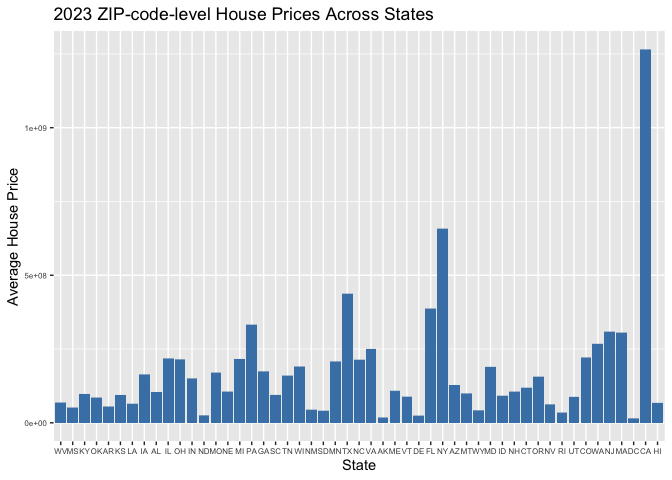
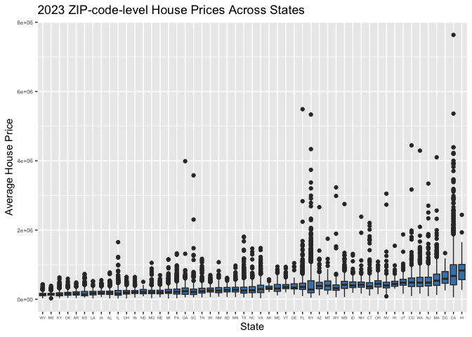
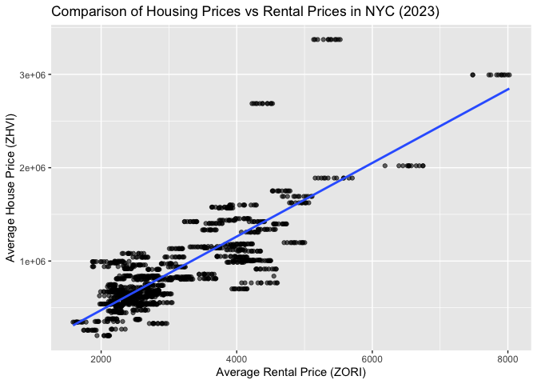

p8105_mtp_mz3084-Meitong
================
Meitong Zhou
2024-10-20

``` r
library(tidyverse)
```

    ## ── Attaching core tidyverse packages ──────────────────────── tidyverse 2.0.0 ──
    ## ✔ dplyr     1.1.4     ✔ readr     2.1.5
    ## ✔ forcats   1.0.0     ✔ stringr   1.5.1
    ## ✔ ggplot2   3.5.1     ✔ tibble    3.2.1
    ## ✔ lubridate 1.9.3     ✔ tidyr     1.3.1
    ## ✔ purrr     1.0.2     
    ## ── Conflicts ────────────────────────────────────────── tidyverse_conflicts() ──
    ## ✖ dplyr::filter() masks stats::filter()
    ## ✖ dplyr::lag()    masks stats::lag()
    ## ℹ Use the conflicted package (<http://conflicted.r-lib.org/>) to force all conflicts to become errors

``` r
library(rvest)
```

    ## 
    ## Attaching package: 'rvest'
    ## 
    ## The following object is masked from 'package:readr':
    ## 
    ##     guess_encoding

# Question 1

Importing, Reshaping and Cleaning Dataset.

``` r
# First, we need to read the three tables. When observing the data set, I found that the dates in the zori and zhvi files did not look neat, so I used `pivot_longer` to make the data set look more beautiful.
zori_data = read.csv("Zillow/Zip_zori_uc_sfrcondomfr_sm_month_NYC.csv") 
zori_data = janitor::clean_names(zori_data) |>
    pivot_longer(
    cols = starts_with("x20"),
    names_to = "date",
    values_to = "rental_price"
  )

url = "https://p8105.com/data/zip_codes.html"
zip_code_data = read_html(url) |>
  html_table(fill = TRUE)
zip_code_data = zip_code_data[[1]]
zip_code_data = janitor::clean_names(zip_code_data)
zhvi_data = read.csv("Zillow/Zip_zhvi_uc_sfrcondo_tier_0.33_0.67_sm_sa_month_2023.csv")
zhvi_data = janitor::clean_names(zhvi_data) |>
   pivot_longer(
    cols = starts_with("x20"),
    names_to = "date",
    values_to = "house_price"
  )
```

Mutating a new column

``` r
zip_code_data = zip_code_data |>
  mutate(borough = case_when(
    county == "New York" ~ "Manhattan",
    county == "Kings" ~ "Brooklyn",
    county == "Queens" ~ "Queens",
    county == "Bronx" ~ "Bronx",
    county == "Richmond" ~ "Staten Island"
  ))
```

``` r
# When I merged these two tables, I found that these two tables have different variable name: zip_code and region_name, so I unified the name.
zori_data = zori_data |>
  rename(zip_code = region_name)
head(zori_data)
```

    ## # A tibble: 6 × 11
    ##   region_id size_rank zip_code region_type state_name state city     metro      
    ##       <int>     <int>    <int> <chr>       <chr>      <chr> <chr>    <chr>      
    ## 1     62080         4    11368 zip         NY         NY    New York New York-N…
    ## 2     62080         4    11368 zip         NY         NY    New York New York-N…
    ## 3     62080         4    11368 zip         NY         NY    New York New York-N…
    ## 4     62080         4    11368 zip         NY         NY    New York New York-N…
    ## 5     62080         4    11368 zip         NY         NY    New York New York-N…
    ## 6     62080         4    11368 zip         NY         NY    New York New York-N…
    ## # ℹ 3 more variables: county_name <chr>, date <chr>, rental_price <dbl>

Merging two tables

``` r
merged_data = merge(zori_data, zip_code_data, by = "zip_code")
head(merged_data) 
```

    ##   zip_code region_id size_rank region_type state_name state     city
    ## 1    10001     61615      4444         zip         NY    NY New York
    ## 2    10001     61615      4444         zip         NY    NY New York
    ## 3    10001     61615      4444         zip         NY    NY New York
    ## 4    10001     61615      4444         zip         NY    NY New York
    ## 5    10001     61615      4444         zip         NY    NY New York
    ## 6    10001     61615      4444         zip         NY    NY New York
    ##                                   metro     county_name        date
    ## 1 New York-Newark-Jersey City, NY-NJ-PA New York County x2015_01_31
    ## 2 New York-Newark-Jersey City, NY-NJ-PA New York County x2015_02_28
    ## 3 New York-Newark-Jersey City, NY-NJ-PA New York County x2015_03_31
    ## 4 New York-Newark-Jersey City, NY-NJ-PA New York County x2015_04_30
    ## 5 New York-Newark-Jersey City, NY-NJ-PA New York County x2015_05_31
    ## 6 New York-Newark-Jersey City, NY-NJ-PA New York County x2015_06_30
    ##   rental_price   county state_fips county_code county_fips  file_date
    ## 1     3855.089 New York         36          61       36061 07/25/2007
    ## 2     3892.376 New York         36          61       36061 07/25/2007
    ## 3     3898.212 New York         36          61       36061 07/25/2007
    ## 4     3969.644 New York         36          61       36061 07/25/2007
    ## 5     4033.221 New York         36          61       36061 07/25/2007
    ## 6     4070.808 New York         36          61       36061 07/25/2007
    ##          neighborhood   borough
    ## 1 Chelsea and Clinton Manhattan
    ## 2 Chelsea and Clinton Manhattan
    ## 3 Chelsea and Clinton Manhattan
    ## 4 Chelsea and Clinton Manhattan
    ## 5 Chelsea and Clinton Manhattan
    ## 6 Chelsea and Clinton Manhattan

``` r
# In this project we focus on the zip code, borough, rental price and date.
final_data = merged_data |>
  select(zip_code, borough, rental_price, date)
final_data = final_data |> 
  filter(!is.na(rental_price))
head(final_data)
```

    ##   zip_code   borough rental_price        date
    ## 1    10001 Manhattan     3855.089 x2015_01_31
    ## 2    10001 Manhattan     3892.376 x2015_02_28
    ## 3    10001 Manhattan     3898.212 x2015_03_31
    ## 4    10001 Manhattan     3969.644 x2015_04_30
    ## 5    10001 Manhattan     4033.221 x2015_05_31
    ## 6    10001 Manhattan     4070.808 x2015_06_30

``` r
write.csv(final_data, file = "final_data.csv", row.names = FALSE)
```

``` r
summary(final_data)
```

    ##     zip_code       borough           rental_price      date          
    ##  Min.   :10001   Length:10677       Min.   :1102   Length:10677      
    ##  1st Qu.:10028   Class :character   1st Qu.:2243   Class :character  
    ##  Median :10463   Mode  :character   Median :2702   Mode  :character  
    ##  Mean   :10643                      Mean   :2889                     
    ##  3rd Qu.:11221                      3rd Qu.:3373                     
    ##  Max.   :11693                      Max.   :8423

``` r
final_data = final_data |>
  filter(!is.na(borough)) |>
  distinct()
```

``` r
total_observations = nrow(final_data)
unique_zip_codes = length(unique(final_data$zip_code))
unique_boroughs = length(unique(final_data$borough))
```

In the merged data, Total observations: 10677 Number of unique zip
codes: 149 Number of unique boroughs: 5

``` r
#Since we are focused on 2023 home values, we will select ZIP code, city, state, house price and date, I also change the region_name into zip_code, so that the variable name can be easy to understand.
zhvi_df = zhvi_data |>
  select(region_name, state_name, county_name, house_price, city, date)

zhvi_df = zhvi_df |>
  rename(zip_code = region_name)
head(zhvi_df)
```

    ## # A tibble: 6 × 6
    ##   zip_code state_name county_name      house_price city  date       
    ##      <int> <chr>      <chr>                  <dbl> <chr> <chr>      
    ## 1    77494 TX         Fort Bend County     479748. Katy  x2023_01_31
    ## 2    77494 TX         Fort Bend County     478434. Katy  x2023_02_28
    ## 3    77494 TX         Fort Bend County     477387. Katy  x2023_03_31
    ## 4    77494 TX         Fort Bend County     478611. Katy  x2023_04_30
    ## 5    77494 TX         Fort Bend County     480636. Katy  x2023_05_31
    ## 6    77494 TX         Fort Bend County     483795. Katy  x2023_06_30

``` r
# Check for any missing values or inconsistencies in the dataset.
summary(zhvi_df)
```

    ##     zip_code      state_name        county_name         house_price     
    ##  Min.   : 1001   Length:316056      Length:316056      Min.   :  21585  
    ##  1st Qu.:25971   Class :character   Class :character   1st Qu.: 173765  
    ##  Median :47806   Mode  :character   Mode  :character   Median : 260104  
    ##  Mean   :48307                                         Mean   : 337987  
    ##  3rd Qu.:70358                                         3rd Qu.: 400793  
    ##  Max.   :99929                                         Max.   :7743993  
    ##                                                        NA's   :4952     
    ##      city               date          
    ##  Length:316056      Length:316056     
    ##  Class :character   Class :character  
    ##  Mode  :character   Mode  :character  
    ##                                       
    ##                                       
    ##                                       
    ## 

# Question 2

``` r
library(dplyr)
library(knitr)
```

``` r
# change the date into as.Date format
final_data = final_data |>
  mutate(date = as.Date(gsub("^x", "", date), format = "%Y_%m_%d"))
```

``` r
zip_observations = final_data |>
  group_by(zip_code) |>
  summarise(Observations = n()) |>
  arrange(Observations)


missing_observations = zip_observations |>
  filter(Observations < 116)


print(missing_observations)
```

    ## # A tibble: 100 × 2
    ##    zip_code Observations
    ##       <int>        <int>
    ##  1    10453            1
    ##  2    10470            1
    ##  3    11366            1
    ##  4    11369            1
    ##  5    11426            1
    ##  6    11693            1
    ##  7    10162            2
    ##  8    10303            2
    ##  9    10459            2
    ## 10    10460            2
    ## # ℹ 90 more rows

The reason that many ZIP codes in the NYC Rental dataset have fewer
observations because 1. Data Gaps: Some ZIP codes may have missing data
for certain months due to incomplete records or data collection issues.
2. Low Rental Activity: Certain areas may have had low rental activity,
leading to fewer recorded data points.

``` r
zori_zip_codes = unique(zori_data$zip_code)
zip_code_data_zip_codes = unique(zip_code_data$zip_code)


zori_zip_count = length(zori_zip_codes)
zip_code_data_count = length(zip_code_data$zip_code)


missing_in_rental = setdiff(zip_code_data$zip_code, zori_zip_codes)


cat("Number of postal codes in rental dataset: ", zori_zip_count, "\n")
```

    ## Number of postal codes in rental dataset:  149

``` r
cat("The number of postal codes in the postal code dataset: ", zip_code_data_count, "\n")
```

    ## The number of postal codes in the postal code dataset:  322

``` r
cat("Postal codes that are in the postal code dataset but missing from the rental dataset: \n", missing_in_rental, "\n")
```

    ## Postal codes that are in the postal code dataset but missing from the rental dataset: 
    ##  10464 10474 10475 10499 10550 10704 10705 10803 11202 11224 11239 11241 11242 11243 11245 11247 11251 11252 11256 10008 10020 10041 10043 10045 10047 10048 10055 10072 10080 10081 10082 10087 10101 10102 10103 10104 10105 10106 10107 10108 10109 10110 10111 10112 10113 10114 10115 10116 10117 10118 10119 10120 10121 10122 10123 10124 10125 10126 10129 10130 10131 10132 10133 10138 10149 10150 10151 10152 10153 10154 10155 10156 10157 10158 10159 10160 10161 10163 10164 10165 10166 10167 10168 10169 10170 10171 10172 10173 10174 10175 10176 10177 10178 10179 10185 10197 10199 10213 10242 10249 10256 10259 10260 10261 10265 10268 10269 10270 10271 10272 10273 10274 10275 10276 10277 10278 10279 10281 10285 10286 10292 11001 11004 11005 11040 11096 11351 11352 11359 11362 11363 11371 11380 11381 11386 11405 11411 11412 11413 11414 11416 11417 11419 11420 11421 11422 11423 11424 11425 11427 11428 11429 11430 11431 11433 11436 11439 11451 11499 11559 11580 11690 11694 11695 11697 10302 10307 10309 10310 10311 10313

There are 149 zip codes in the rental dataset, and 322 zip codes in the
zip code dataset. This means that there are quite a few zip codes that
have no rental records in the rental dataset. This may be because there
is less demand for rentals in some areas, so they are not counted.

``` r
final_data = final_data |>
  mutate(date = as.Date(gsub("^x", "", date), format = "%Y_%m_%d"))

final_data = final_data |>
  mutate(year = as.numeric(format(date, "%Y")))


avg_rent_borough_year = final_data |>
  group_by(borough, year) |>
  summarise(avg_rent = mean(rental_price, na.rm = TRUE)) |>
  arrange(borough, year)
```

    ## `summarise()` has grouped output by 'borough'. You can override using the
    ## `.groups` argument.

``` r
print(avg_rent_borough_year)
```

    ## # A tibble: 5 × 3
    ## # Groups:   borough [5]
    ##   borough        year avg_rent
    ##   <chr>         <dbl>    <dbl>
    ## 1 Bronx            NA    2012.
    ## 2 Brooklyn         NA    2706.
    ## 3 Manhattan        NA    3348.
    ## 4 Queens           NA    2403.
    ## 5 Staten Island    NA    2288.

The table shows that rental prices rose steadily from 2015 to 2024.
However, during the COVID-19 pandemic (2020-2021), rents in some
boroughs fell sharply. After the pandemic, rents rose again as demand
returned to New York City.

``` r
# Since the date cannot be shown if I directly made the table, I tried to re-upload the final_data file.
final_data = read.csv("final_data.csv", stringsAsFactors = FALSE)


str(final_data)
```

    ## 'data.frame':    10677 obs. of  4 variables:
    ##  $ zip_code    : int  10001 10001 10001 10001 10001 10001 10001 10001 10001 10001 ...
    ##  $ borough     : chr  "Manhattan" "Manhattan" "Manhattan" "Manhattan" ...
    ##  $ rental_price: num  3855 3892 3898 3970 4033 ...
    ##  $ date        : chr  "x2015_01_31" "x2015_02_28" "x2015_03_31" "x2015_04_30" ...

``` r
# Remove the "x" prefix and convert the string to date format
final_data = final_data |>
  mutate(date = as.Date(gsub("^x", "", date), format = "%Y_%m_%d"))


print(unique(final_data$date))
```

    ##   [1] "2015-01-31" "2015-02-28" "2015-03-31" "2015-04-30" "2015-05-31"
    ##   [6] "2015-06-30" "2015-07-31" "2015-08-31" "2015-09-30" "2015-10-31"
    ##  [11] "2015-11-30" "2015-12-31" "2016-01-31" "2016-02-29" "2016-03-31"
    ##  [16] "2016-04-30" "2016-05-31" "2016-06-30" "2016-07-31" "2016-08-31"
    ##  [21] "2016-09-30" "2016-10-31" "2016-11-30" "2016-12-31" "2017-01-31"
    ##  [26] "2017-02-28" "2017-03-31" "2017-04-30" "2017-05-31" "2017-06-30"
    ##  [31] "2017-07-31" "2017-08-31" "2017-09-30" "2017-10-31" "2017-11-30"
    ##  [36] "2017-12-31" "2018-01-31" "2018-02-28" "2018-03-31" "2018-04-30"
    ##  [41] "2018-05-31" "2018-06-30" "2018-07-31" "2018-08-31" "2018-09-30"
    ##  [46] "2018-10-31" "2018-11-30" "2018-12-31" "2019-01-31" "2019-02-28"
    ##  [51] "2019-03-31" "2019-04-30" "2019-05-31" "2019-06-30" "2019-07-31"
    ##  [56] "2019-08-31" "2019-09-30" "2019-10-31" "2019-11-30" "2019-12-31"
    ##  [61] "2020-01-31" "2020-02-29" "2020-03-31" "2020-04-30" "2020-05-31"
    ##  [66] "2020-06-30" "2020-07-31" "2020-08-31" "2020-09-30" "2020-10-31"
    ##  [71] "2020-11-30" "2020-12-31" "2021-01-31" "2021-02-28" "2021-03-31"
    ##  [76] "2021-04-30" "2021-05-31" "2021-06-30" "2021-07-31" "2021-08-31"
    ##  [81] "2021-09-30" "2021-10-31" "2021-11-30" "2021-12-31" "2022-01-31"
    ##  [86] "2022-02-28" "2022-03-31" "2022-04-30" "2022-05-31" "2022-06-30"
    ##  [91] "2022-07-31" "2022-08-31" "2022-09-30" "2022-10-31" "2022-11-30"
    ##  [96] "2022-12-31" "2023-01-31" "2023-02-28" "2023-03-31" "2023-04-30"
    ## [101] "2023-05-31" "2023-06-30" "2023-07-31" "2023-08-31" "2023-09-30"
    ## [106] "2023-10-31" "2023-11-30" "2023-12-31" "2024-01-31" "2024-02-29"
    ## [111] "2024-03-31" "2024-04-30" "2024-05-31" "2024-06-30" "2024-07-31"
    ## [116] "2024-08-31"

``` r
rent_change = final_data |>
  filter(date %in% c("2020-01-31", "2021-01-31")) |>
  pivot_wider(names_from = date, values_from = rental_price) |>
  mutate(price_drop = `2020-01-31` - `2021-01-31`) |>
  filter(!is.na(price_drop)) |>
  group_by(borough) |>
  summarise(largest_drop = min(price_drop, na.rm = TRUE),
            neighborhood = zip_code[which.min(price_drop)],
            .groups = "drop")

print(rent_change)
```

    ## # A tibble: 4 × 3
    ##   borough   largest_drop neighborhood
    ##   <chr>            <dbl>        <int>
    ## 1 Bronx            -95.0        10467
    ## 2 Brooklyn         -14.2        11229
    ## 3 Manhattan        -36.5        10463
    ## 4 Queens          -101.         11432

Bronx: The largest rent drop was -94.9528548 in ZIP Code 10467.
Brooklyn: The largest rent drop was -14.2157959 in ZIP Code 11229.
Manhattan: The largest rent drop was -36.50 in ZIP Code 10463. Queens:
The largest rent drop was -36.5001011 in ZIP Code 10463. As can be seen
from the table, the rent drops in Queens and the Bronx were larger,
which may be related to the higher population density in these areas
during the epidemic.

## Question 3

``` r
final_data = final_data |>
  filter(!is.na(rental_price)) |>
  mutate(date = as.Date(date, format = "%Y_%m_%d"))
ggplot(final_data, aes(x = date, y = rental_price, color = borough)) +
  geom_line(aes(group = zip_code), alpha = 0.4) +
  facet_wrap(~ borough) +
  labs(title = "NYC Rental Prices Across ZIP Codes (2015-2024)",
       x = "Year",
       y = "Rental Price (ZORI)") +
  theme(legend.position = "bottom")
```

<!-- -->

``` r
ggsave("results/nyc_rental_prices.png", width = 10, height = 6)
```

Rental prices in Manhattan are significantly higher than in other areas
and with a significant drop and rapid recovery from 2020 to 2021
(pandamic), indicating that the pandemic has had a significant impact on
Manhattan’s high-rent market, especially office space and high-end
residential markets; Brooklyn and Queens have experienced slight
fluctuations during the pandemic, but have grown steadily overall; Bronx
rents have grown more slowly and steadily. Data for Staten Island is
insufficient.

``` r
zhvi_df = zhvi_df |>
  group_by(zip_code, state_name) |>
  summarise(avg_house_price = mean(house_price, na.rm = TRUE))
```

    ## `summarise()` has grouped output by 'zip_code'. You can override using the
    ## `.groups` argument.

``` r
ggplot(zhvi_df, aes(x = reorder(state_name, avg_house_price), y = avg_house_price)) +
  geom_bar(stat = "identity", fill = "steelblue") +
  coord_flip() +
  labs(title = "2023 ZIP-code-level House Prices Across States",
       x = "State",
       y = "Average House Price") +
  theme(legend.position = "bottom")
```

    ## Warning: Removed 116 rows containing missing values or values outside the scale range
    ## (`geom_bar()`).

<!-- -->

``` r
# For thr last plot, I found that there is one state's house price over 1 billion, which is too extreme. Therefore, I remove some extreme value and make the plot again.
summary(zhvi_df$avg_house_price)
```

    ##    Min. 1st Qu.  Median    Mean 3rd Qu.    Max.    NA's 
    ##   23380  173264  259124  336694  398801 7636362     116

``` r
zhvi_df_df = zhvi_df |>
  filter(avg_house_price < 1e6)


ggplot(zhvi_df, aes(x = reorder(state_name, avg_house_price), y = avg_house_price)) +
  geom_bar(stat = "identity", fill = "steelblue") +
  coord_flip() +
  labs(title = "2023 ZIP-code-level House Prices Across States (Filtered)",
       x = "State",
       y = "Average House Price") +
theme(legend.position = "bottom")
```

    ## Warning: Removed 116 rows containing missing values or values outside the scale range
    ## (`geom_bar()`).

<!-- -->
Housing prices in several states are much higher than in other states,
such as California (CA) and Texas (TX). However, housing prices in some
states such as Idaho (ID), Montana (MT), North Dakota (ND) are
significantly lower than other parts of the country, indicating that
there is a large gap in housing prices between regions in US.

``` r
nyc_prices_2023 = merge(
  zhvi_df |>
    select(zip_code, avg_house_price),
  final_data |>
    filter(format(date, "%Y") == "2023") |>
    group_by(zip_code) |>
    summarise(avg_rental_price = mean(rental_price, na.rm = TRUE)),
  by = "zip_code"
)


ggplot(nyc_prices_2023, aes(x = avg_rental_price, y = avg_house_price)) +
  geom_point(alpha = 0.6) +
  labs(title = "Comparison of Housing Prices vs Rental Prices in NYC (2023)",
       x = "Average Rental Price (ZORI)",
       y = "Average House Price (ZHVI)") +
 theme(legend.position = "bottom")
```

<!-- -->
There is a positive correlation between housing prices and rental
prices. Higher housing prices are usually accompanied by higher rents.
In addition, the data points are concentrated in the rental price range
of 2,000 to 4,000, and the housing prices are concentrated in the range
of 1 million to 3 million. This area reflects the housing and rental
price situation in NYC.

The Zillow dataset does not include ZIP codes in all regions, and some
ZIP codes have incomplete or missing rental or housing price data. In
addition, some years of data in the dataset are missing, especially
during the COVID-19 period, which may not reflect the true dynamics of
the market.
